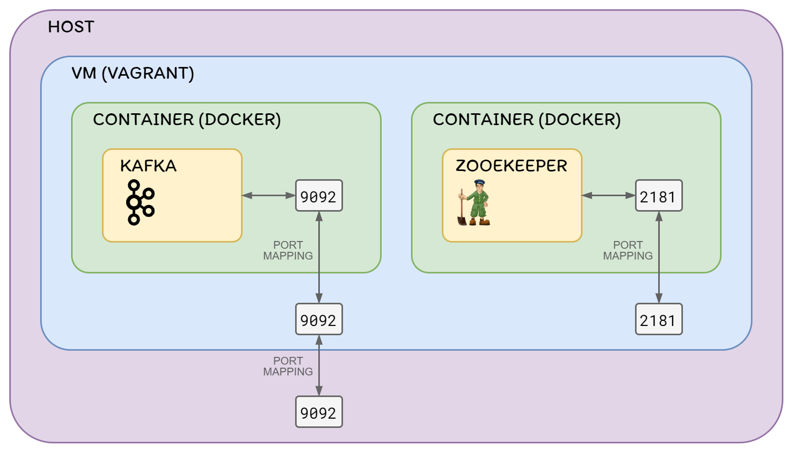

# Vagrant Docker Kafka

__This project shows how to run Kafka, inside a Docker container, inside a VM, using Vagrant.__

> With this, __you don't need to install Docker or Python__ on your local computer.  
> __You just need to install Vagrant and VirtualBox__.

## Architecture

Vagrant creates an Ubuntu VM that installs Docker and Docker-Compose,
pulls Docker images for Zookeeper and Kafka from DockerHub, and runs containers
for Zookeeper and Kafka, with the corresponding port mappings.

Kafka will be accessible to the host machine through port 9092.

The following diagram shows the architecture:



## Prerequisites

* [Install VirtualBox](https://www.virtualbox.org/wiki/Downloads)
* [Install Vagrant](https://www.vagrantup.com/docs/installation)
* Install the docker-compose Vagrant plugin:
  ```bash
  vagrant plugin install vagrant-docker-compose
  ```

### Verify installation

Check that the `vagrant` executable was added correctly to the `PATH` variable:
```bash
vagrant version
```

Check that vagrant is able to create a VM:
```bash
mkdir test-vagrant
cd test-vagrant
vagrant init hashicorp/bionic64
vagrant up
vagrant ssh
pwd
exit
vagrant destroy --force
cd ..
rm -rf test-vagrant
```

> ⚠️ If the following error appears after executing `vagrant up`:  
> __`No usable default provider could be found for your system.`__
>
> 1. Verify that VirtualBox was installed correctly
> 2. Obtain more info about the error:
>    ```
>    vagrant up --provider=virtualbox
>    ```

> ⚠️ If the following error appears after executing `vagrant up`:  
> __`VBoxManage: error: Details: code NS_ERROR_FAILURE (0x80004005)`__
>
> * Reinstall VirtualBox

Check that the `vagrant-docker-compose` plugin was installed correctly:
```bash
vagrant plugin list | grep "vagrant-docker-compose"
```

## Kafka topics

This example will create 2 kafka topics:
* topic1: 1 partition, 1 replica
* topic2: 1 partition, 1 replica

This is specified in the `docker-compose-single-broker.yml` file, in the following line:
```yaml
KAFKA_CREATE_TOPICS: "topic1:1:1,topic2:1:1"
```

You can modify this by specifying a comma-separated list of `<topic>:<partitions>:<replicaction-factor>`.

These are the topics created at the creation of the Kafka cluster,
but you can create more topics after that manually (the way to create them is explained below).

## Steps to execute

All the `vagrant` commands must be executed in the host machine from the folder
that contains the Vagrantfile (in this case, the project root folder).

> __ℹ️ Note for Windows users:__
>
> If Vagrant doesn't show any output in the stdout for a Vagrant command after some time,
> press the Enter key or right click in the console window.  
> See [this post](https://superuser.com/questions/1442941/windows-10-console-stops-running-if-i-click-in-the-console-window) for more info about this problem.

### Start the VM [host]

This will install Docker inside that VM, pull the Kafka and Zookeeper Docker images from DockerHub,
and run a container for each of those images, with the corresponding port mappings.

```bash
vagrant up
```

> The following messages should appear at the end of the command stdout:
> ```
> Creating vagrant_zookeeper_1 ... done
> Creating vagrant_kafka_1     ... done
> ```

### Check the status of the VM [host]

```bash
vagrant status
```

### (Optionally) Connect to the VM [host]

This connection is done via ssh.

```bash
vagrant ssh
```

> __ℹ️ Some interesting commands to execute inside the VM:__
>
> | Commmand                                  | Description                                                                                                                            |
> | ----------------------------------------- | -------------------------------------------------------------------------------------------------------------------------------------- |
> | `free -h`                                 | Display amount of free and used memory in the VM                                                                                       |
> | `docker stats`                            | Display a live stream of container(s) resource usage statistics. <br /> Useful to monitor Docker containers memory usage.              |
> | `docker container ls --all`               | List all Docker containers (running or not). <br /> If both containers specify "Up" in the status column, everything is running fine.  |
> | `docker logs <containerid>`               | Fetch the logs of a container. <br /> Really useful to troubleshoot Kafka or Zookeeper servers, or to simply see what's going on.      |
> | `docker top <containerid>`                | Display the running processes of a container                                                                                           |
> | `docker exec -it <containerid> <command>` | Run a command in a running container (in interactive mode)                                                                             |
> | `docker images`                           | List images                                                                                                                            |
> | `docker version`                          | Show the Docker version information                                                                                                    |
> | `docker info`                             | Display system-wide information                                                                                                        |
> | `netstat -tulpn \| grep LISTEN`           | Display network connections (listening TCP or UDP). <br /> Useful to check that Kafka (9092) and Zookeeper (2181) ports are listening. |

### (Optionally) Connect to one of the Docker containers [vm]

First, you must connect to the VM (steps above).

Obtain the id of the container you want to connect to:
```bash
docker container ls --all
```

Execute the bash command in that container to connect to it:
```bash
docker exec -it <containerid> bash
```

#### Kafka commands
Inside the Kafka container:

| Description                            | Commmand                                                                                                                                              |
| -------------------------------------- | ----------------------------------------------------------------------------------------------------------------------------------------------------- |
| List topics                            | `/opt/kafka/bin/kafka-topics.sh --bootstrap-server localhost:9092 --list`                                                                             |
| Describe topics                        | `/opt/kafka/bin/kafka-topics.sh --bootstrap-server localhost:9092 --describe`                                                                         |
| Create topic                           | `/opt/kafka/bin/kafka-topics.sh --bootstrap-server localhost:9092 --create --replication-factor <replicas> --partitions <partitions> --topic <topic>` |
| Delete topic                           | `/opt/kafka/bin/kafka-topics.sh --bootstrap-server localhost:9092 --delete --topic <topic>`                                                           |
| Create Kafka Producer                  | `/opt/kafka/bin/kafka-console-producer.sh --bootstrap-server localhost:9092 --topic <topic>`                                                          |
| Create Kafka Consumer (from latest)    | `/opt/kafka/bin/kafka-console-consumer.sh --bootstrap-server localhost:9092 --topic <topic>`                                                          |
| Create Kafka Consumer (from beginning) | `/opt/kafka/bin/kafka-console-consumer.sh --bootstrap-server localhost:9092 --topic <topic> --from-beginning`                                         |

#### Check connectivity from Kafka to Zookeeper
The following commands, executed inside the Kafka container, allow to check connectivity to Zookeeper:

```bash
apk update

ping zookeeper

apk add bind-tools
dig zookeeper

nc -z -v zookeeper 2181

apk add openssl
openssl s_client -connect zookeeper:2181
```

### Stop the VM (keeps Kafka data) [host]

Stopping the VM will stop the Docker containers and turn off the VM.  
All the Kafka data (topics, events, etc) is persisted inside the containers,
and a subsequent turn on of the VM (and the containers) will have access to that data.


Stop the VM:
```bash
vagrant halt
```

Check the status of the VM:
```bash
vagrant status
```

Start the VM and the containers again:
```bash
vagrant up
```

### Destroy the VM (removes Kafka data) [host]

Destroying the VM will remove all the VM data, and therefore, the containers inside it.  
For that reason, the Kafka data is also removed.  
This should be the option used if you do not want to keep the Kafka data,
and you want to have a "clean" environment in the next turn on of the VM
(because the VM and the containers will be created from scratch).

```bash
vagrant destroy
```

## Additional notes

By default, the Vagrantfile uses the `docker-compose-single-broker.yml` Docker compose file
to pull the Kafka and Zookeeper images and run the containers.  
This file only defines the execution of 1 Kafka broker, and therefore, 1 Docker container for Kafka.

This project also includes a `docker-compose.yml` file, which should allow to create Kafka clusters
of more than 1 broker, but this hasn't been tested yet, and that Docker compose file should probably
be tunned.

Whenever you change the Docker compose file, you need to run `vagrant reload` to redefine the Vagrant box.

If you need another version of Docker compose, you need to specify the `compose_version` option
in the Vagrantfile (defaults to `1.24.1`), in the `config.vm.provision :docker_compose` line.

## References

* [Vagrant](https://www.vagrantup.com/)
* [Docker](https://www.docker.com/)
* [Kafka](https://kafka.apache.org/)
* [Vagrant Docker provisioner](https://www.vagrantup.com/docs/provisioning/docker)
* [Vagrant Docker Compose provisioner](https://github.com/leighmcculloch/vagrant-docker-compose#to-install-rebuild-and-run-docker-compose-on-vagrant-up)
* [Kafka Docker image](https://hub.docker.com/r/wurstmeister/kafka)
* [Vagrant commands](https://www.vagrantup.com/docs/cli)
* [Docker commands](https://docs.docker.com/engine/reference/commandline/docker/)
